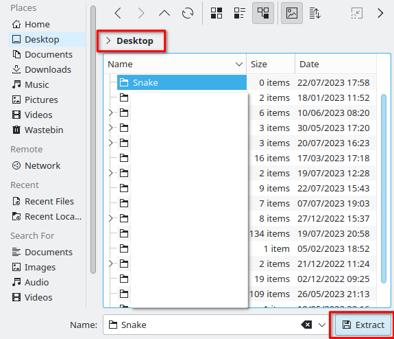
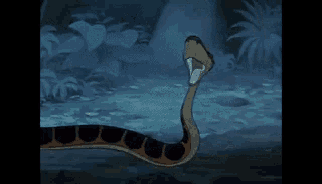

# Snake

## Demonstration

https://github.com/LunaTMT/Snake/assets/44672093/0da04875-07a1-4c1d-ab0d-f39501541e41

## Setup

The code is created such that the user can select any _reasonable_ board size and have a comfortable playing experience. For the best experience, I recommend setting the board size to 20. Anything < 50 is what I would deem reasonable.

To change the board size, please navigate to the main file and change the value for k to your desired size.

<figure><figcaption></figcaption></figure>

## How to run

Before beginning please make sure you have [python](https://www.python.org/downloads/) installed on your system.

<figure><figcaption></figcaption></figure>

* Download the files from the GitHub repository

<figure><figcaption></figcaption></figure>

* Export the contents of the zipped folder to a given location

<figure><figcaption></figcaption></figure>

<figure><figcaption></figcaption></figure>

* Once the contents have been exported to a folder, navigate to this folder and open main.py

<figure><figcaption></figcaption></figure>

* Execute the file by clicking on the _"Run"_ tab at the top and then clicking _"Run Module."_ Or you can simply press _"F5"_

<figure><figcaption></figcaption></figure>

## Personal Overview

This project was surpisingly quite easy to create, especially if we consider the deault texture of the snake I had initially implemented - strictly pygame colours rather than the images I currently have. This aim of this project was just a test of my ability and to see if I was actually able to create the snake game in a robust and clear OO style.

### Improvements

I would've quite liked to have implemented animations for the snake body such as:

*   a swaying of the body from side-to-side as snakes do in real life when they move (slithering). However, upon attempting to implement this I found it a little too hard and didnt want to spend too long on one feature. Pherhaps with more experience and more projects under my belt I could remake this.

    <figure><figcaption></figcaption></figure>
* To include enemy snakes that use user must dodge. I was simply too lazy to implement this and am satisfied with the default standard snake game for now.
* A starting menu with options for snake textures or just standard colours
* A solving algorithm that would complete the board for you. Again looking into this it seemed a little too advanced with my current skill set. Fortunately the discrete maths book I've been studying for the past 8 months did cover graphs and hamiltonion paths so it wasn't completely foreign.

### Future projects

The following projects I am going to attempt to develop are:

* Minesweeper
* 2048
* Doodle Jump
